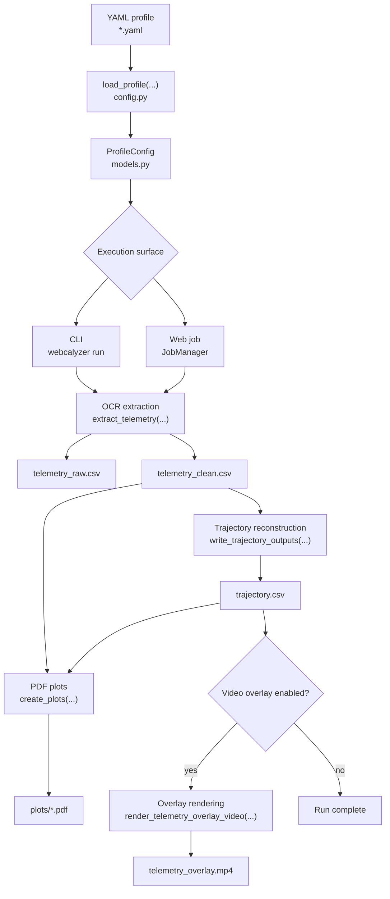
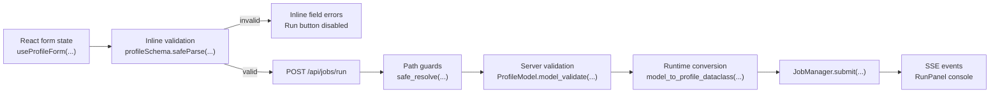

# Architecture

Webcalyzer is a single Python package with an optional bundled web UI. The runtime is deliberately local: videos are read from disk, outputs are written to disk, templates are YAML files, and the web server exposes only paths inside configured roots. The configuration contract is detailed in [config-model.md](config-model.md), and the API boundary is detailed in [web-backend.md](web-backend.md).

## System Shape

### Tech stack

| Layer | Technology | Notes |
|---|---|---|
| Python package | Python 3.11+, setuptools | CLI entry point is `webcalyzer = webcalyzer.cli:main`. |
| Data model | Dataclasses | Canonical runtime types live in `src/webcalyzer/models.py`. |
| YAML I/O | PyYAML | `load_profile(...)` and `save_profile(...)` convert between YAML and dataclasses. |
| OCR | Apple Vision or RapidOCR | Vision on macOS when available, RapidOCR for portable ONNXRuntime OCR. |
| Numeric processing | NumPy, pandas, SciPy | Filtering, interpolation, smoothing, trajectory reconstruction, and plotting. |
| Plotting | Matplotlib | Writes PDF review artifacts through a non-interactive backend. |
| Video processing | OpenCV, ffmpeg | OpenCV fallback renderer, ffmpeg accelerated overlay path when installed. |
| Web backend | FastAPI, Uvicorn, Pydantic v2 | Local API, path-safe file browser, template CRUD, job execution, SSE logs. |
| Web frontend | Vite, React 18, TypeScript, Tailwind, shadcn-style primitives | Static bundle served by FastAPI in production mode. |
| Frontend validation | Zod | Mirrors Pydantic constraints for inline form feedback. |

### Module map

```text
src/webcalyzer/
  cli.py                 CLI parser and subcommand orchestration
  models.py              Canonical dataclasses and runtime DTOs
  config.py              YAML load, save, defaults, and legacy aliases
  extract.py             OCR Phase A and Phase B extraction pipeline
  sanitize.py            OCR text normalization, unit parsing, MET parsing
  postprocess.py         Clean rebuild and outlier rejection
  trajectory.py          Interpolation, integration, downrange reconstruction
  acceleration.py        Velocity smoothing and acceleration derivation
  plotting.py            PDF plot generation
  overlay.py             Overlay planning and OpenCV renderer
  overlay_ffmpeg.py      ffmpeg renderer and encoder selection
  rescue.py              Multi-variant re-OCR for failed raw samples
  raw_points.py          Hardcoded anchor point injection
  fixtures.py            Review frame and contact sheet generation
  calibration.py         OpenCV desktop calibration UI
  ocr.py                 OCR backend protocol, RapidOCR backend, image variants
  vision_backend.py      Apple Vision backend
  ocr_factory.py         Backend option resolution
  video.py               Video metadata, frame reading, crops, drawing helpers
  web/
    app.py               FastAPI app factory and endpoints
    files.py             Root-scoped file browser helpers
    jobs.py              Single-active-job runner and SSE fan-out
    schema.py            Pydantic profile schema and converters

web/src/
  App.tsx                Route table
  pages/                 Run, Calibrate, Templates, Documentation pages
  components/            Shell, forms, pickers, job panel, UI primitives
  components/profile/    One editor section per profile group
  lib/                   API wrapper, Zod schema, form state, docs registry
```

See [file-map.md](file-map.md) for a wider annotated listing.

## Flow Boundaries

### Runtime flow



The web runner and CLI use the same pipeline functions. The web layer adds JSON validation, path guards, background execution, and SSE event delivery, but it must not create a separate pipeline branch. Stage ownership is documented in [pipeline.md](pipeline.md).

### Web request flow



The server validates every run request even when the frontend form already passed. The client check exists for inline UX only. Frontend state ownership is documented in [web-frontend.md](web-frontend.md#profile-form-state).

### Local filesystem boundary

The local app is not a general file server. All user-provided paths pass through root-scoped helpers before they are read or written.

| Behavior | Owner | Rule |
|---|---|---|
| File browsing | `src/webcalyzer/web/files.py` | Resolve paths and reject anything outside configured roots. |
| Video metadata and frames | `src/webcalyzer/web/app.py` | Read only after root containment succeeds. |
| Output directories | `src/webcalyzer/web/app.py` | Create only inside a writable configured root. |
| Template names | `src/webcalyzer/web/app.py` | Reject absolute paths, parent traversal, and invalid template names. |

Do not bypass these helpers when adding endpoints.

## Verification

### Architecture checks

Use these checks after architecture-level changes:

```bash
python3 -m pytest
cd web && npm run build
webcalyzer serve --root "$PWD" --templates-dir "$PWD/configs"
```

Then verify `/api/meta`, `/api/templates`, and one existing `/api/templates/{name}` response from the running server.
