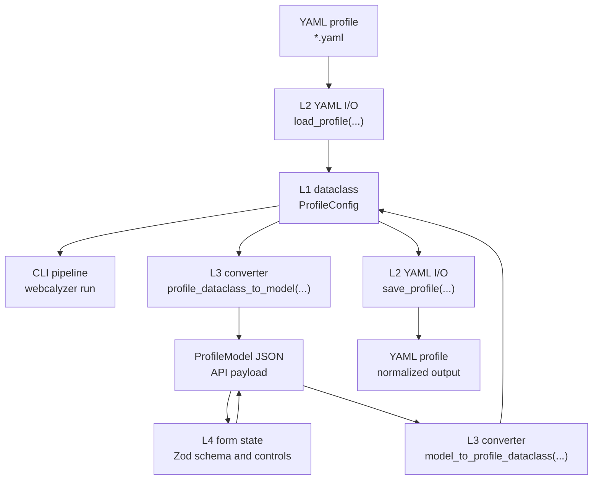

# Configuration Model

The profile model is the most important cross-surface contract in webcalyzer. YAML files, CLI runs, web API payloads, and React forms all represent the same configuration shape. See [architecture.md](architecture.md) for the full runtime flow and [web-frontend.md](web-frontend.md#profile-form-state) for client form ownership.

## Layer Contract

### Configuration layers

| Layer | File | Responsibility |
|---|---|---|
| L1 dataclass | `src/webcalyzer/models.py` | Canonical runtime types consumed by pipeline code. |
| L2 YAML I/O | `src/webcalyzer/config.py` | Loads YAML into dataclasses, saves dataclasses to YAML, defines parser defaults, accepts legacy aliases. |
| L3 Pydantic schema | `src/webcalyzer/web/schema.py` | Server-side validation mirror and dataclass converters for the API. |
| L4 Zod schema and form | `web/src/lib/schema.ts`, `web/src/components/profile/*Section.tsx` | Client-side validation and editable form surface. |
| TypeScript DTO | `web/src/lib/api.ts` | Typed API surface used by frontend callers. |

Every user-settable field must exist in all layers. Missing one layer creates a drift bug.

### Root profile fields

| Field | Runtime type | Notes |
|---|---|---|
| `profile_name` | `str` | Validated with `[A-Za-z0-9._\- ]+`. |
| `description` | `str` | Free text. |
| `default_sample_fps` | `float` | Must be greater than `0` and at most `240`. |
| `fixture_frame_count` | `int` | Must be from `1` to `2000`. |
| `fixture_time_range_s` | `tuple[float, float]` or `None` | Optional `[start, end]`, non-negative, `end > start`. |
| `video_overlay` | `VideoOverlayConfig` | Overlay rendering settings. |
| `trajectory` | `TrajectoryConfig` | Dense reconstruction settings. |
| `parsing` | `ParsingProfile` or `None` | `None` means use bundled defaults. |
| `hardcoded_raw_data_points` | `list[HardcodedRawDataPoint]` | Trusted telemetry values injected into raw data. |
| `fields` | `dict[str, FieldConfig]` | At least one field required. |

### Nested profile groups

| Group | Required shape | Notes |
|---|---|---|
| `fields.*` | `kind`, `stage`, `bbox_x1y1x2y2` | UI labels `kind` as **Type**. `stage` must be `null` only for `met`. |
| `video_overlay` | `enabled`, `plot_mode`, `width_fraction`, `height_fraction`, `output_filename`, `include_audio` | Fractions are constrained to the visible frame and filename cannot contain path separators. |
| `trajectory` | interpolation, integration, smoothing, derivative, and `launch_site` settings | Launch-site values are optional but ranges are enforced when present. |
| `parsing.velocity` | unit definitions and inference settings | Unit references must point to declared unit names. |
| `parsing.altitude` | unit definitions and inference settings | SI conversion target is meters. |
| `parsing.met` | `timestamp_patterns` | Every regex must compile. |
| `hardcoded_raw_data_points.*` | `mission_elapsed_time_s` plus optional telemetry values | At least one telemetry value is required per point. |

## Conversion and Compatibility

### Conversion flow



The intended invariant is a fixed point for profiles that load cleanly. A profile should survive the sequence YAML, L1, L3, JSON, L3, L1, YAML with equivalent content modulo accepted defaults and normalized formatting.

### Defaults

`default_parsing_profile()` defines bundled parsing defaults for profiles with no `parsing` block. `default_parsing_model()` exposes the same defaults to the web UI through `/api/meta`.

Keep these defaults aligned:

| Default area | Python owner | Web owner |
|---|---|---|
| velocity units and aliases | `config.default_parsing_profile()` | `schema.default_parsing_model()` through conversion |
| altitude units and aliases | `config.default_parsing_profile()` | `schema.default_parsing_model()` through conversion |
| MET regex patterns | `config.default_parsing_profile()` | `schema.default_parsing_model()` through conversion |
| custom OCR words | `config.default_parsing_profile()` | `schema.default_parsing_model()` through conversion |

### YAML compatibility

`config.py` accepts a small set of legacy aliases:

| Current field | Accepted alias or compatibility behavior |
|---|---|
| `fields.*.bbox_x1y1x2y2` | `fields.*.box` |
| `fixture_time_range_s` | Mapping with `start` and `end`, mapping with `lower` and `upper`, or legacy `fixture_reference_times_s` min and max. |
| `hardcoded_raw_data_points` | `hardcoded_raw_points` |
| `mission_elapsed_time_s` | `met_s` or `timestamp_s` inside a hardcoded point. |
| `trajectory.launch_site.*` | Legacy top-level trajectory keys `launch_latitude_deg`, `launch_longitude_deg`, `launch_azimuth_deg`. |
| `trajectory.integration_step_s` | Accepted and ignored for backward compatibility. |

Compatibility belongs in L2. Do not make pipeline code branch on legacy YAML shapes.

### Validation symmetry

Server validation is final. Client validation exists for inline UX and should mirror server constraints:

- numeric ranges for sampling, fixture counts, overlay fractions, launch site, smoothing, and derivative parameters
- regex compilation for MET timestamp patterns
- bounding box range and ordering
- stage/type consistency for fields
- valid enum values for interpolation, integration, smoothing mode, overlay plot mode, and field type
- unit references for default and inferred units
- at least one telemetry value in every hardcoded raw data point

When a constraint changes, update both `src/webcalyzer/web/schema.py` and `web/src/lib/schema.ts`. Endpoint validation behavior is documented in [web-backend.md](web-backend.md#profile-validation).

## Change Workflow

### Add a profile field

For a new field such as `trajectory.foo_bar_s`:

1. Add it to the L1 dataclass and serialization in `models.py`.
2. Load and save it in `config.py` with a backward-compatible default.
3. Add the Pydantic field and both dataclass converters in `web/schema.py`.
4. Add the TypeScript DTO, Zod schema, empty profile default, and form control.
5. Use the value in pipeline code if it changes behavior.
6. Update user docs, internal docs, README, and `AGENTS.md` when the surface changes.
7. Smoke-test YAML load, web validation, save, reload, and CLI run construction.

### Verification

Configuration changes should pass:

```bash
python3 -m pytest
cd web && npm run build
webcalyzer serve --root "$PWD" --templates-dir "$PWD/configs"
```

Then check:

- `GET /api/meta`
- `GET /api/templates`
- `GET /api/templates/<existing>`
- `POST /api/profile/validate`
- `POST /api/profile/preview-yaml`
- `webcalyzer run --video <video> --config <profile> --output <dir>` starts from the same profile shape
