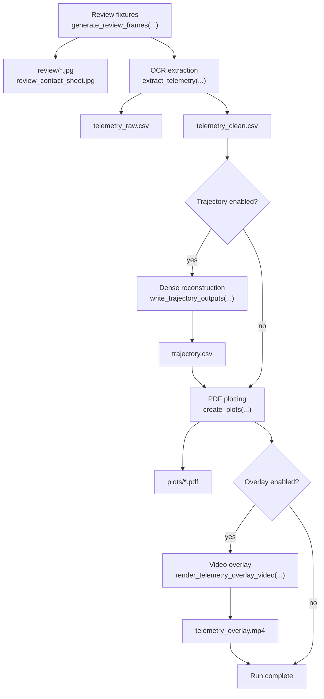
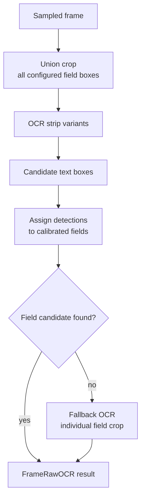
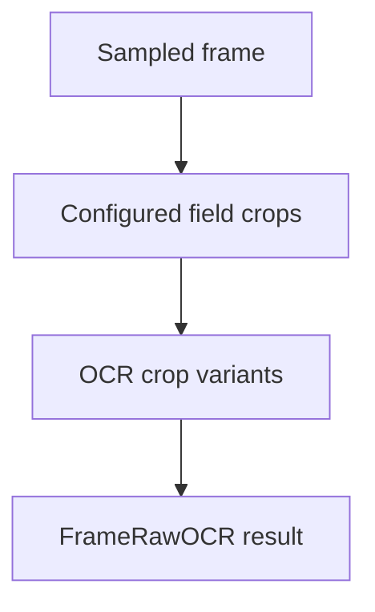
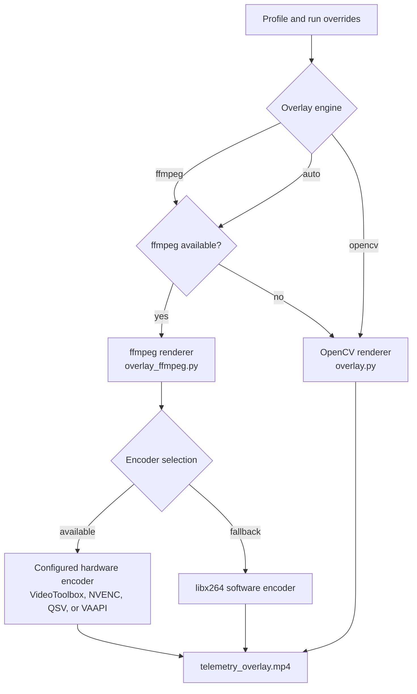

# Pipeline

The extraction pipeline transforms sampled video frames into raw OCR observations, clean telemetry, dense trajectory data, PDF plots, and an optional overlay video. Each stage is callable from the CLI, and the web job runner invokes the same functions in the same order as `webcalyzer run`.

## Run Order and Sampling

### Full run phases



`cli.py` and `web/jobs.py` both follow this phase order. The web runner emits phase events and checks cancellation between phases.

### Frame sampling

`generate_review_frames(...)` uses `evenly_spaced_indices(...)` to select fixture frames from either the full video or `fixture_time_range_s`. It draws profile boxes onto the frames and writes a contact sheet.

`build_sample_indices(...)` selects OCR frames at the effective sample rate. The effective rate is the CLI or web override when present, otherwise `ProfileConfig.default_sample_fps`.

The corresponding source frame index is chosen from the video time grid. This keeps OCR cadence independent from the source frame rate. The user-facing interpretation of sampling cadence is documented in [trajectory reconstruction](../user/trajectory-reconstruction.md#use-mission-elapsed-time-as-the-clock).

### OCR backend selection

`OCRBackendOptions` carries backend and Vision recognition level. `resolve_backend_name(...)` resolves:

| Request | Result |
|---|---|
| `auto` on macOS with Vision bindings | `vision` |
| `auto` otherwise | `rapidocr` |
| `rapidocr` | RapidOCR backend |
| `vision` | Apple Vision backend, error when unavailable |

`make_backend(...)` constructs the backend. Heavy OCR imports stay inside backend creation paths where practical.

## OCR and Telemetry Cleanup

### OCR Phase A

Phase A is stateless and parallelizable. It receives frame indices, opens video captures, OCRs each sampled frame, and returns `FrameRawOCR` results.

Default detection mode:



Skip-detection mode:



Skip-detection mode can be faster, but it removes detection fallback behavior. Use it only when calibration boxes are stable.

### OCR Phase B

Phase B is sequential because it uses temporal context. It reads Phase A results in time order, parses mission elapsed time, tracks plausible stage state, chooses the best measurement candidate per field, and writes raw rows.

Unit inference only happens inside the parsing layer. Downstream stages should consume SI columns. The user-facing unit model is documented in [trajectory reconstruction](../user/trajectory-reconstruction.md#convert-ocr-readings-into-physical-units).

### Clean rebuild and outliers

`rebuild_clean_from_raw(...)` builds `telemetry_clean.csv` from raw observations. It uses parsed mission elapsed time, stage/type consistency, measurement plausibility, and hardcoded raw data points.

`apply_mahalanobis_outlier_rejection(...)` can reject multivariate outliers over a rolling window. Rejected rows are preserved in `telemetry_rejected.csv` when available.

## Trajectory and Output Stages

### Trajectory ownership

| Area | Owner | Notes |
|---|---|---|
| Interpolation setup | `trajectory.reconstruct_trajectory(...)` | Creates interpolation functions for retained stage velocity and altitude columns. |
| Integration | `trajectory._integrate_scalar(...)` | Applies the configured integration method over each dense interval. |
| Downrange | `trajectory.reconstruct_trajectory(...)` | Converts path increments and altitude increments into horizontal distance. |
| Geodesic projection | `trajectory._wgs84_direct(...)` | Computes WGS84 positions when launch site and azimuth are configured. |
| Acceleration | `acceleration.acceleration_profile(...)` | Smooths velocity and derives acceleration with source-gap masking. |

The reconstruction concepts and notation for these outputs belong in [trajectory reconstruction](../user/trajectory-reconstruction.md). Keep internal docs focused on ownership and invariants.

### Interpolation

`reconstruct_trajectory(...)` builds interpolation functions for retained velocity and altitude samples. Supported methods are `linear`, `pchip`, `akima`, and `cubic`.

The dense time grid uses mission elapsed time as its independent variable. Missing or sparse data limits which stage columns can be reconstructed.

### Integration and downrange

`_integrate_scalar(...)` integrates velocity over one interval using the configured method. The reconstruction then separates climb from horizontal motion before accumulating downrange distance.

The user-facing explanation is in [trajectory reconstruction](../user/trajectory-reconstruction.md#separate-climb-from-downrange-travel).

### Launch-site geodesic projection

When latitude, longitude, and azimuth are configured, trajectory output includes WGS84 direct-geodesic positions. The launch site and azimuth are passed to `_wgs84_direct(...)` with the accumulated downrange distance.

When any launch-site value is missing, the trajectory remains valid but only flat downrange distance is reported.

### Acceleration

`acceleration_profile(...)` estimates acceleration from reconstructed or clean velocity. The configured window length, polynomial order, minimum window samples, and edge mode control how much local structure is preserved. `acceleration_source_gap_threshold_s` masks acceleration where the source data gap is too large.

### Plotting

`create_plots(...)` reads clean telemetry, rejected telemetry when present, and trajectory output when present. It writes PDF artifacts under `plots/`.

Matplotlib must use a non-interactive backend in the web job context. Creating GUI windows from a worker thread can fail on macOS, so plotting code should write files without instantiating a GUI backend.

### Overlay rendering

`render_telemetry_overlay_video(...)` builds a synchronized panel from clean telemetry, optional rejected points, optional trajectory data, and source video timing. The overlay time coordinate maps source video time to mission elapsed time using the extracted run timeline.

The renderer path is:



ffmpeg encoder selection tries configured hardware encoders when requested, then can fall back to `libx264`.

## Verification

### Pipeline checks

Pipeline changes should be checked with:

```bash
python3 -m pytest
webcalyzer run --video <video> --config <profile> --output <dir>
webcalyzer reconstruct-trajectory --output <dir>
webcalyzer render-overlay --video <video> --output <dir>
```

For web execution, run the same scenario through **Run** and confirm that the output directory contains raw telemetry, clean telemetry, trajectory output when enabled, plots, `config_resolved.yaml`, and overlay video when enabled.
