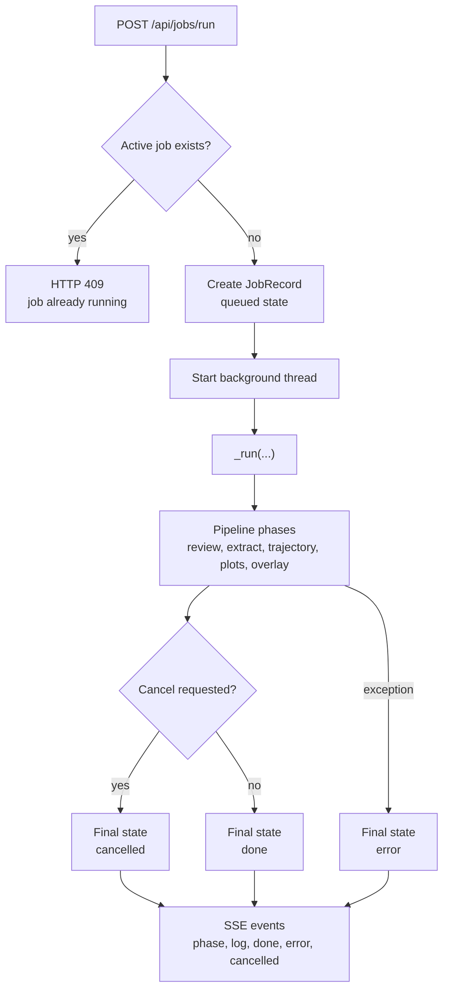

# Web Backend

The web backend is a FastAPI app created by `create_app(...)`. It exposes local APIs for metadata, root-scoped file browsing, video probing, template CRUD, profile validation, calibration saves, job execution, SSE logs, and output-file downloads. The surrounding runtime structure is documented in [architecture.md](architecture.md), and the shared profile contract is documented in [config-model.md](config-model.md).

## App Surface

### App factory

`ServeConfig` carries:

| Field | Type | Notes |
|---|---|---|
| `roots` | `list[BrowseRoot]` | Allowed filesystem roots for reads and writes. |
| `templates_dir` | `Path` | Directory containing YAML templates. |
| `dist_dir` | `Path or None` | Built React bundle directory. |
| `cors_origins` | `list[str]` | Development CORS origins. |

`create_app(config)` stores the config on `app.state.config` and creates `app.state.jobs = JobManager()`.

### Endpoint groups

| Prefix | Methods | Responsibility |
|---|---|---|
| `/api/meta` | `GET` | Version, roots, templates directory, trajectory choices, default parsing model. |
| `/api/files` | `GET` | Root-scoped file browser. |
| `/api/video/*` | `GET` | Metadata, frame JPEGs, and fixture frame lists. |
| `/api/templates*` | `GET`, `PUT`, `POST`, `DELETE` | List, load, save, import, download, and delete YAML templates. |
| `/api/profile/*` | `POST` | Validate a profile and render a YAML preview. |
| `/api/calibrate/save` | `POST` | Save calibration edits back to a template. |
| `/api/jobs*` | `GET`, `POST` | Submit runs, inspect jobs, cancel jobs, stream events, download output files. |

Non-API paths fall back to the React SPA when `dist_dir` exists.

### Path safety

All user-provided filesystem paths must pass through path helpers:

| Helper | Used for | Behavior |
|---|---|---|
| `safe_resolve(path, roots)` | File browser reads | Resolves a path and rejects it unless it is under a configured root. |
| `_ensure_within(config, path)` | Video and read paths | Wraps `safe_resolve(...)` and converts errors to HTTP 403. |
| `_ensure_within_writable(config, path)` | Output directories | Resolves, checks root containment, creates the directory, and returns it. |
| `_resolve_template_path(config, name, must_exist)` | Template names | Rejects absolute paths, `..`, invalid characters, and paths outside `templates_dir`. |

Do not bypass these helpers in new endpoints.

## Profile and Template APIs

### Template flow

`GET /api/templates` recursively lists `*.yaml` under `templates_dir`. Each file is loaded with `load_profile(...)` when possible. Files with parse errors are still listed with an `error` string.

`GET /api/templates/{name}` loads YAML into `ProfileConfig`, converts it to `ProfileModel`, and returns JSON.

`PUT /api/templates/{name}` validates posted JSON with `ProfileModel.model_validate(...)`, converts to `ProfileConfig`, and saves YAML with `save_profile(...)`.

`POST /api/templates/import` accepts raw YAML text, writes it only after path validation, validates that `load_profile(...)` succeeds, and removes the file if parsing fails.

Note: The frontend refreshes template pickers after a save. Backend template endpoints should keep returning the canonical list immediately after writes.

### Profile validation

`POST /api/profile/validate` validates JSON and returns normalized JSON.

`POST /api/profile/preview-yaml` validates JSON, converts it through `serialize_for_yaml(...)`, and returns YAML text.

Validation errors are cleaned by `_format_validation_error(...)` so FastAPI responses contain JSON-serializable details instead of raw Pydantic exception context.

## Job Execution

### Job lifecycle

`POST /api/jobs/run` validates paths and profile JSON, builds `JobOptions`, and submits the job to `JobManager`. The phase order is documented in [pipeline.md](pipeline.md#full-run-phases).

`JobManager` enforces one active job:



Cancellation is cooperative. Long phases should call `_check_cancel(job)` at phase boundaries or at safe checkpoints.

### Event stream

`GET /api/jobs/{id}/events` streams events through SSE. Each event has:

| Field | Type | Notes |
|---|---|---|
| `kind` | `str` | Examples include `phase`, `log`, `done`, `error`, and `cancelled`. |
| `message` | `str` | Human-readable event text. |
| `payload` | `dict or null` | Optional structured data. |
| `timestamp` | `str` | Event timestamp serialized for the client. |

The stream closes after `done`, `error`, or `cancelled`.

### Output files

The job runner records finished output paths relative to the output directory. The frontend links those paths through `api.jobFileUrl(...)`; see [web-frontend.md](web-frontend.md#run-console).

Files under `review/` are intentionally excluded from the run console output list. Review JPEGs and contact sheets still exist on disk, but they are not shown among the primary finished artifacts.

### Logging capture

Pipeline output reaches the UI through:

| Capture path | Owner | Notes |
|---|---|---|
| stdout and stderr redirection | `_StreamingTextIO` | Captures `print(...)` and low-level text output during a job. |
| standard logging handler | `_StreamingLogHandler` | Captures records emitted through Python logging. |
| explicit events | `JobManager._emit(...)` | Used for phase changes, final states, and structured messages. |

Pipeline modules may use `print(...)` or logging. Both should remain visible in the run console.

## Serving and Verification

### Static serving

When `dist_dir` exists, FastAPI serves frontend assets and falls back to `index.html` for non-API paths. This allows React Router to own `/`, `/calibrate`, `/templates`, and `/documentation`.

When `dist_dir` is missing, API endpoints can still run, but the production web UI is unavailable.

### Verification

Backend changes should pass:

```bash
python3 -m pytest
webcalyzer serve --root "$PWD" --templates-dir "$PWD/configs"
```

Then verify:

- `GET /api/meta`
- `GET /api/files`
- `GET /api/templates`
- load one existing template
- run `POST /api/profile/validate` with that template payload
- submit a short job or confirm validation and path errors are returned cleanly
