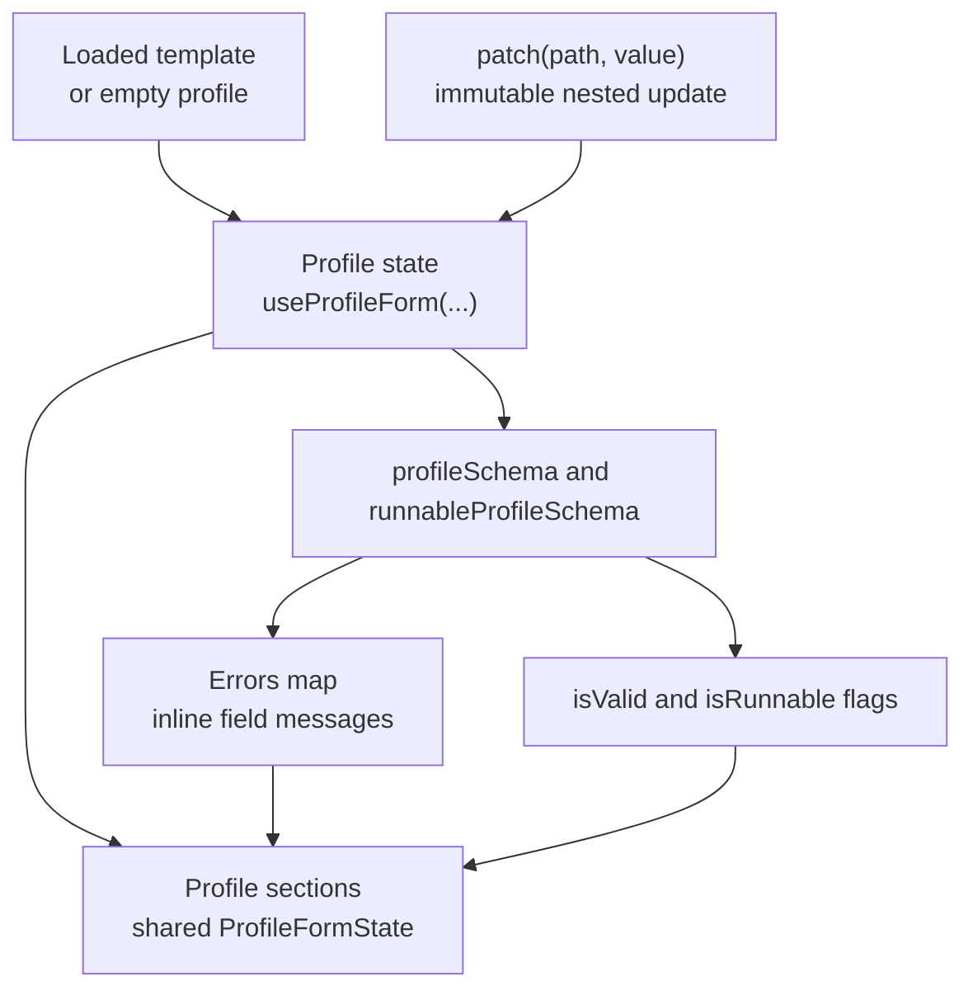

# Web Frontend

The frontend is a Vite React app under `web/src/`. It is compiled into `web/dist/` and served by FastAPI. It has no external state-management library; local React state and small custom hooks own page behavior. Backend endpoints are documented in [web-backend.md](web-backend.md), and profile validation rules are documented in [config-model.md](config-model.md).

## App Shell and API

### Route map

| Route | Component | Purpose |
|---|---|---|
| `/` | `RunPage` | Full extraction configuration and job submission. |
| `/calibrate` | `CalibratePage` | Frame-scrubber segment calibration with canonical field slots. |
| `/quantities` | `QuantityLibraryPage` | Reusable telemetry quantity library with dimensions, units, aliases, and usage-aware deletion. |
| `/templates` | `TemplatesPage` | Template list, import, download, and delete. |
| `/documentation` | `DocumentationPage` | In-app reader for `docs/user` and `docs/internal`. |

`AppShell` provides the persistent sidebar, mobile top nav, templates directory display, roots display, version badge, and page layout.

### API wrapper

`web/src/lib/api.ts` defines DTO types that mirror `ProfileModel`, quantity library responses, job responses, and video metadata. Keep these types in sync with `src/webcalyzer/web/schema.py` and `src/webcalyzer/web/app.py`.

The wrapper uses `fetch`, parses JSON error details when possible, and throws `ApiError` with status and details.

## Profile Editing

### Profile form state

`useProfileForm(initial)` owns the current `Profile`, derived Zod validation errors, and immutable path updates through `patch(path, value)`.



Section components receive the same `ProfileFormState`. They do not keep independent copies of profile sub-state.

### Profile sections

| Section | Component | Profile paths |
|---|---|---|
| **General** | `GeneralSection` | `profile_name`, `description`, `default_sample_fps`, `default_ocr_workers`, OCR runtime fields, fixtures |
| **Trajectory** | `TrajectorySection` | `trajectory.*` |
| **Anchor points** | `HardcodedPointsSection` | `hardcoded_raw_data_points` |
| **Video overlay** | `VideoOverlaySection` | `video_overlay.*` |
| **Segments** | `SegmentsSection` | `segments.*`, `calibration_video.*` |
| **Parsing** | `ParsingSection` | `parsing.*` |

The first four sections are primary. **Segments** and **Parsing** live under **Advanced settings** because most users edit boxes through calibration and use default parsing. Custom quantities embedded in the profile are enabled through calibration and surfaced in the segments and anchor point sections.

Note: In user-facing UI text, call field `kind` the field **Type**. Keep `kind` only where the raw schema key is unavoidable.

### File picking

`PathPicker` opens `FileBrowserDialog`, which calls `/api/files`. The browser never uploads videos. It sends absolute local paths chosen from roots that the backend has already exposed.

| Mode | Behavior |
|---|---|
| `video` | Show directories and recognized video files. |
| `directory` | Show directories for output selection. |

## Run and Template Workflows

### Run console

`RunPanel` subscribes to `/api/jobs/{id}/events` with `EventSource`. It appends logs, tracks phase events, applies `progress` event output lists, exposes cancellation, and links output files through `api.jobFileUrl(...)`. Server-side job behavior is documented in [web-backend.md](web-backend.md#job-lifecycle).

The console has two presentation modes:

| Mode | State | Behavior |
|---|---|---|
| `dialog` | default when a job starts | Centered dialog with the standard dark overlay. The built-in X and outside click dock the console. |
| `docked` | user-selected | Card placed at the top of the run page content flow with a focus button to reopen the dialog. |

The controls use lucide icons from the existing app icon set. Review files under `review/` are filtered out of the displayed output links.

### Template picker blank reset

`TemplatePicker` receives a refresh key from pages that save templates. After **Save as template** succeeds, the parent increments the refresh key so the dropdown reloads and selects the newly saved template.

The picker action button starts from a blank template. Pages provide the reset callback and dirty-state boolean. If there are unsaved profile or calibration edits, the picker opens a confirmation dialog before discarding them.

### Quantity library

`QuantityLibraryPage` owns the library view for `custom_quantities.yaml`. It loads `/api/quantities`, separates default and custom quantities, opens a dialog for create or edit, normalizes dimensionality through `/api/dimensions/normalize`, and requests typical display units through `/api/units/si`.

The dimensionality and display-unit inputs provide local suggestions from `/api/meta`. Deleting a custom quantity first calls `/api/quantities/{id}/usage` and shows affected templates before the delete request is sent.

`CalibratePage` uses the same quantity DTOs. **Add quantity** merges library quantities with already embedded profile quantities, enables the selected field across all segments, and embeds a profile snapshot when the selected quantity is not canonical.

## Documentation and UI Conventions

### Documentation reader

`DocumentationPage` imports Markdown files with Vite `?raw`, groups them through `DOC_GROUPS`, extracts H2 and H3 headings for a local table of contents, renders Markdown to trusted HTML, and intercepts local `.md` links so navigation stays inside the page.

The sidebar uses separate controls for disclosure and navigation. The chevron button only expands or collapses that page's section list. The title button only navigates to the page. Expanded pages are independent, so opening one page does not collapse another.

Supported Markdown features are:

| Feature | Renderer support |
|---|---|
| H1 through H4 | rendered with generated anchors |
| paragraphs | inline code, bold text, links, and inline math |
| fenced code blocks | escaped and styled |
| Mermaid code fences | rendered as SVG diagrams |
| tables | scrollable wrapper |
| blockquotes | styled as documentation callouts |
| `Note:` and `Remark:` | styled marker blocks |
| `$...$` and `$$...$$` | rendered with KaTeX as inline or display math |

The docs source of truth remains the top-level `docs/` directory. The UI is a reader, not an editor. Writing rules live in [WEBAPP-DOCS-STYLE.md](../WEBAPP-DOCS-STYLE.md).

### Tooltip behavior

Field help text comes from `web/src/lib/explanations.ts`. On hover-capable devices, the tooltip is exposed from the label or field surface. On mobile, the explicit info button remains available.

Tooltip copy should stay concise, should not contain typos, and should follow the project punctuation rule against em dashes.

### Select controls

`web/src/components/ui/select.tsx` owns the shared select trigger and item styles. Wrapped selected values must remain left-aligned even when the label spans more than one line.

Any select styling change should be checked with long labels in the profile template picker and profile section controls.

### Styling conventions

The UI is dark-only and uses CSS variables from `web/src/index.css`. Components should use Tailwind tokens such as `bg-card`, `text-muted-foreground`, `border-border`, and `text-primary`.

Use `cn(...)` from `web/src/lib/utils.ts` for conditional class composition. Use `lucide-react` icons for buttons and status controls.

## Build

### Build constraints

Frontend changes should pass:

```bash
cd web
npm run build
```

For UI behavior changes, also verify the relevant route in a browser-sized desktop viewport and a mobile viewport. In particular, check that sidebars and main content scroll independently.
